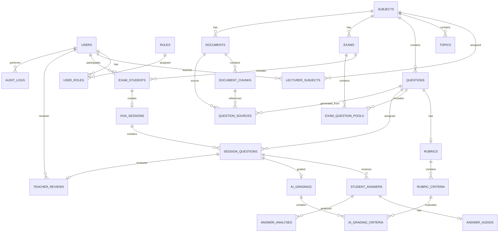
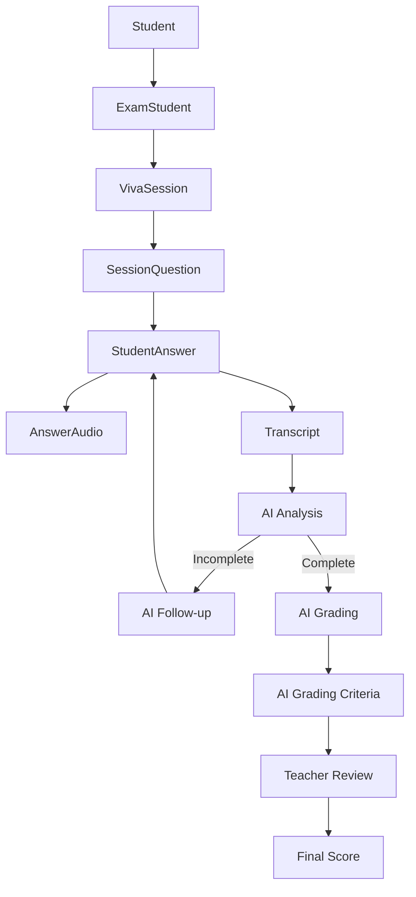

# AIVES – Database ERD

> **Project:** AI-powered Viva Exam System (AIVES)  
> **Backend:** ASP.NET Core .NET  
> **Database:** SQL Server  
> **ORM:** Entity Framework Core

---

## 1. Tổng quan

Database của AIVES được chia thành 8 nhóm:

1. User & Authorization
2. Academic Structure
3. Question Bank & Rubric
4. Exam Management
5. Viva Session
6. AI Analysis & Grading
7. Document / RAG
8. Audit & Transparency

> `BaseEntity`, `AuditableEntity` và `IAggregateRoot` thuộc Domain Layer, **không phải bảng database**.

---

# 2. ERD tổng thể



---

# 3. User & Authorization

## 3.1 Users

Lưu tài khoản của:

- Admin
- Lecturer
- Student

| Field | Type | Constraint | Description |
|---|---|---|---|
| Id | uniqueidentifier | PK | User ID |
| Email | nvarchar(255) | UNIQUE, NOT NULL | Email đăng nhập |
| PasswordHash | nvarchar(500) | NOT NULL | Password đã hash |
| FullName | nvarchar(255) | NOT NULL | Họ tên |
| Status | varchar(50) | NOT NULL | ACTIVE / INACTIVE / LOCKED |
| CreatedAt | datetime2 | NOT NULL | Ngày tạo |
| CreatedBy | uniqueidentifier | NULL | Người tạo |
| UpdatedAt | datetime2 | NULL | Ngày cập nhật |
| UpdatedBy | uniqueidentifier | NULL | Người cập nhật |

---

## 3.2 Roles

| Field | Type | Constraint | Description |
|---|---|---|---|
| Id | uniqueidentifier | PK | Role ID |
| Name | varchar(50) | UNIQUE, NOT NULL | ADMIN / LECTURER / STUDENT |
| CreatedAt | datetime2 | NOT NULL | Ngày tạo |
| CreatedBy | uniqueidentifier | NULL | Người tạo |
| UpdatedAt | datetime2 | NULL | Ngày cập nhật |
| UpdatedBy | uniqueidentifier | NULL | Người cập nhật |

---

## 3.3 UserRoles

Quan hệ nhiều-nhiều giữa `Users` và `Roles`.

| Field | Type | Constraint |
|---|---|---|
| Id | uniqueidentifier | PK |
| UserId | uniqueidentifier | FK → Users.Id |
| RoleId | uniqueidentifier | FK → Roles.Id |
| CreatedAt | datetime2 | NOT NULL |
| CreatedBy | uniqueidentifier | NULL |
| UpdatedAt | datetime2 | NULL |
| UpdatedBy | uniqueidentifier | NULL |

### Unique Constraint

```text
(UserId, RoleId)
```

---

# 4. Academic Structure

## 4.1 Subjects

| Field | Type | Constraint |
|---|---|---|
| Id | uniqueidentifier | PK |
| Code | nvarchar(50) | UNIQUE, NOT NULL |
| Name | nvarchar(255) | NOT NULL |
| Description | nvarchar(max) | NULL |
| Status | varchar(50) | NOT NULL |
| CreatedAt | datetime2 | NOT NULL |
| CreatedBy | uniqueidentifier | NULL |
| UpdatedAt | datetime2 | NULL |
| UpdatedBy | uniqueidentifier | NULL |

Ví dụ:

```text
Code: PRN222
Name: Programming with C#
```

---

## 4.2 Topics

Một môn học có nhiều chủ đề.

| Field | Type | Constraint |
|---|---|---|
| Id | uniqueidentifier | PK |
| SubjectId | uniqueidentifier | FK → Subjects.Id |
| Name | nvarchar(255) | NOT NULL |
| Description | nvarchar(max) | NULL |
| Status | varchar(50) | NOT NULL |
| CreatedAt | datetime2 | NOT NULL |
| CreatedBy | uniqueidentifier | NULL |
| UpdatedAt | datetime2 | NULL |
| UpdatedBy | uniqueidentifier | NULL |

Quan hệ:

```text
Subject 1 ---- N Topic
```

---

## 4.3 LecturerSubjects

Phân công Lecturer phụ trách Subject.

| Field | Type | Constraint |
|---|---|---|
| Id | uniqueidentifier | PK |
| LecturerId | uniqueidentifier | FK → Users.Id |
| SubjectId | uniqueidentifier | FK → Subjects.Id |
| AssignedAt | datetime2 | NOT NULL |
| CreatedAt | datetime2 | NOT NULL |
| CreatedBy | uniqueidentifier | NULL |
| UpdatedAt | datetime2 | NULL |
| UpdatedBy | uniqueidentifier | NULL |

### Unique Constraint

```text
(LecturerId, SubjectId)
```

> Không đặt `LecturerId` hoặc `SubjectId` riêng lẻ là UNIQUE.

---

# 5. Question Bank

## 5.1 Questions

| Field | Type | Constraint / Meaning |
|---|---|---|
| Id | uniqueidentifier | PK |
| SubjectId | uniqueidentifier | FK → Subjects.Id |
| TopicId | uniqueidentifier | FK → Topics.Id, NULL |
| Content | nvarchar(max) | NOT NULL |
| ExpectedAnswer | nvarchar(max) | NULL |
| BloomLevel | varchar(50) | REMEMBER / UNDERSTAND / APPLY / ANALYZE |
| Difficulty | varchar(50) | EASY / MEDIUM / HARD |
| SourceType | varchar(50) | MANUAL / AI_GENERATED / DOCUMENT_GENERATED |
| Status | varchar(50) | DRAFT / APPROVED / REJECTED / ARCHIVED |
| CreatedAt | datetime2 | NOT NULL |
| CreatedBy | uniqueidentifier | NULL |
| UpdatedAt | datetime2 | NULL |
| UpdatedBy | uniqueidentifier | NULL |

---

# 6. Rubric

## 6.1 Rubrics

Mỗi Question có tối đa một Rubric.

| Field | Type | Constraint |
|---|---|---|
| Id | uniqueidentifier | PK |
| QuestionId | uniqueidentifier | FK → Questions.Id, UNIQUE |
| Name | nvarchar(255) | NOT NULL |
| Description | nvarchar(max) | NULL |
| TotalScore | decimal(5,2) | NOT NULL |
| CreatedAt | datetime2 | NOT NULL |
| CreatedBy | uniqueidentifier | NULL |
| UpdatedAt | datetime2 | NULL |
| UpdatedBy | uniqueidentifier | NULL |

Quan hệ:

```text
Question 1 ---- 0..1 Rubric
```

---

## 6.2 RubricCriteria

Một Rubric có nhiều tiêu chí.

| Field | Type | Constraint |
|---|---|---|
| Id | uniqueidentifier | PK |
| RubricId | uniqueidentifier | FK → Rubrics.Id |
| Name | nvarchar(255) | NOT NULL |
| Description | nvarchar(max) | NULL |
| ExpectedConcepts | nvarchar(max) | NULL |
| MaxScore | decimal(5,2) | NOT NULL |
| DisplayOrder | int | NOT NULL |
| CreatedAt | datetime2 | NOT NULL |
| CreatedBy | uniqueidentifier | NULL |
| UpdatedAt | datetime2 | NULL |
| UpdatedBy | uniqueidentifier | NULL |

Ví dụ:

```text
Correct definition       2 điểm
Core concepts            3 điểm
Example                  2 điểm
Analysis                  3 điểm
```

---

# 7. Exam Management

## 7.1 Exams

| Field | Type | Constraint / Meaning |
|---|---|---|
| Id | uniqueidentifier | PK |
| SubjectId | uniqueidentifier | FK → Subjects.Id |
| Name | nvarchar(255) | NOT NULL |
| Description | nvarchar(max) | NULL |
| StartAt | datetime2 | NOT NULL |
| EndAt | datetime2 | NOT NULL |
| DurationMinutes | int | NOT NULL |
| NumberOfMainQuestions | int | NOT NULL |
| MaxFollowUpPerQuestion | int | NOT NULL |
| Language | varchar(20) | vi / en |
| Status | varchar(50) | DRAFT / PUBLISHED / ONGOING / COMPLETED / CANCELLED |
| CreatedAt | datetime2 | NOT NULL |
| CreatedBy | uniqueidentifier | NULL |
| UpdatedAt | datetime2 | NULL |
| UpdatedBy | uniqueidentifier | NULL |

---

## 7.2 ExamStudents

Danh sách sinh viên thuộc kỳ thi.

| Field | Type | Constraint |
|---|---|---|
| Id | uniqueidentifier | PK |
| ExamId | uniqueidentifier | FK → Exams.Id |
| StudentId | uniqueidentifier | FK → Users.Id |
| ScheduledStartAt | datetime2 | NULL |
| StartedAt | datetime2 | NULL |
| CompletedAt | datetime2 | NULL |
| Status | varchar(50) | ASSIGNED / IN_PROGRESS / COMPLETED / ABSENT / EXPIRED |
| FinalScore | decimal(5,2) | NULL |
| CreatedAt | datetime2 | NOT NULL |
| CreatedBy | uniqueidentifier | NULL |
| UpdatedAt | datetime2 | NULL |
| UpdatedBy | uniqueidentifier | NULL |

### Unique

```text
(ExamId, StudentId)
```

---

## 7.3 ExamQuestionPools

Ngân hàng câu hỏi mà kỳ thi được phép random.

| Field | Type | Constraint |
|---|---|---|
| Id | uniqueidentifier | PK |
| ExamId | uniqueidentifier | FK → Exams.Id |
| QuestionId | uniqueidentifier | FK → Questions.Id |
| CreatedAt | datetime2 | NOT NULL |
| CreatedBy | uniqueidentifier | NULL |
| UpdatedAt | datetime2 | NULL |
| UpdatedBy | uniqueidentifier | NULL |

### Unique

```text
(ExamId, QuestionId)
```

---

# 8. Viva Session

## 8.1 VivaSessions

Một sinh viên trong một kỳ thi có một phiên thi.

| Field | Type | Constraint |
|---|---|---|
| Id | uniqueidentifier | PK |
| ExamStudentId | uniqueidentifier | FK → ExamStudents.Id, UNIQUE |
| StartedAt | datetime2 | NULL |
| EndedAt | datetime2 | NULL |
| CurrentQuestionIndex | int | NOT NULL |
| RemainingSeconds | int | NULL |
| Status | varchar(50) | NOT_STARTED / IN_PROGRESS / COMPLETED / EXPIRED / CANCELLED |
| CreatedAt | datetime2 | NOT NULL |
| CreatedBy | uniqueidentifier | NULL |
| UpdatedAt | datetime2 | NULL |
| UpdatedBy | uniqueidentifier | NULL |

Quan hệ:

```text
ExamStudent 1 ---- 0..1 VivaSession
```

---

## 8.2 SessionQuestions

Lưu các Question thực sự đã được random cho Student.

| Field | Type | Constraint |
|---|---|---|
| Id | uniqueidentifier | PK |
| VivaSessionId | uniqueidentifier | FK → VivaSessions.Id |
| QuestionId | uniqueidentifier | FK → Questions.Id |
| OrderIndex | int | NOT NULL |
| AssignedAt | datetime2 | NOT NULL |
| Status | varchar(50) | PENDING / ACTIVE / COMPLETED |
| CreatedAt | datetime2 | NOT NULL |
| CreatedBy | uniqueidentifier | NULL |
| UpdatedAt | datetime2 | NULL |
| UpdatedBy | uniqueidentifier | NULL |

### Unique

```text
(VivaSessionId, OrderIndex)
```

Việc lưu bảng này đảm bảo:

```text
Refresh browser
→ không random Question lại
```

---

# 9. Student Answers

## 9.1 StudentAnswers

Một Question có thể có:

```text
Main Answer
Follow-up Answer 1
Follow-up Answer 2
...
```

| Field | Type | Constraint |
|---|---|---|
| Id | uniqueidentifier | PK |
| SessionQuestionId | uniqueidentifier | FK → SessionQuestions.Id |
| ParentAnswerId | uniqueidentifier | FK → StudentAnswers.Id, NULL |
| AnswerType | varchar(50) | MAIN / FOLLOW_UP |
| FollowUpLevel | int | NOT NULL |
| PromptText | nvarchar(max) | NOT NULL |
| Transcript | nvarchar(max) | NULL |
| StartedAt | datetime2 | NULL |
| EndedAt | datetime2 | NULL |
| CreatedAt | datetime2 | NOT NULL |
| CreatedBy | uniqueidentifier | NULL |
| UpdatedAt | datetime2 | NULL |
| UpdatedBy | uniqueidentifier | NULL |

---

## 9.2 AnswerAudios

Lưu metadata audio.

> Không nên lưu file audio binary trực tiếp trong SQL Server.

| Field | Type | Constraint |
|---|---|---|
| Id | uniqueidentifier | PK |
| StudentAnswerId | uniqueidentifier | FK → StudentAnswers.Id, UNIQUE |
| FilePath | nvarchar(1000) | NOT NULL |
| MimeType | varchar(100) | NULL |
| DurationSeconds | int | NULL |
| FileSizeBytes | bigint | NULL |
| CreatedAt | datetime2 | NOT NULL |
| CreatedBy | uniqueidentifier | NULL |
| UpdatedAt | datetime2 | NULL |
| UpdatedBy | uniqueidentifier | NULL |

---

# 10. AI Answer Analysis

## 10.1 AnswerAnalyses

Lưu kết quả AI phân tích câu trả lời để quyết định có hỏi follow-up hay không.

| Field | Type | Constraint |
|---|---|---|
| Id | uniqueidentifier | PK |
| StudentAnswerId | uniqueidentifier | FK → StudentAnswers.Id |
| IsComplete | bit | NOT NULL |
| MissingConcepts | nvarchar(max) | NULL |
| AnalysisSummary | nvarchar(max) | NULL |
| ModelName | varchar(100) | NULL |
| PromptVersion | varchar(50) | NULL |
| CreatedAt | datetime2 | NOT NULL |
| CreatedBy | uniqueidentifier | NULL |
| UpdatedAt | datetime2 | NULL |
| UpdatedBy | uniqueidentifier | NULL |

Ví dụ:

```text
IsComplete = false

MissingConcepts =
"Scoped lifetime, HTTP request scope"
```

---

# 11. AI Grading

## 11.1 AIGradings

AI chấm một `SessionQuestion`.

| Field | Type | Constraint |
|---|---|---|
| Id | uniqueidentifier | PK |
| SessionQuestionId | uniqueidentifier | FK → SessionQuestions.Id, UNIQUE |
| AIScore | decimal(5,2) | NOT NULL |
| AIComment | nvarchar(max) | NULL |
| Strengths | nvarchar(max) | NULL |
| Weaknesses | nvarchar(max) | NULL |
| MissingPoints | nvarchar(max) | NULL |
| ModelName | varchar(100) | NULL |
| PromptVersion | varchar(50) | NULL |
| CreatedAt | datetime2 | NOT NULL |
| CreatedBy | uniqueidentifier | NULL |
| UpdatedAt | datetime2 | NULL |
| UpdatedBy | uniqueidentifier | NULL |

---

## 11.2 AIGradingCriteria

Điểm AI theo từng Rubric Criterion.

| Field | Type | Constraint |
|---|---|---|
| Id | uniqueidentifier | PK |
| AIGradingId | uniqueidentifier | FK → AIGradings.Id |
| RubricCriterionId | uniqueidentifier | FK → RubricCriteria.Id |
| Score | decimal(5,2) | NOT NULL |
| Evidence | nvarchar(max) | NULL |
| Comment | nvarchar(max) | NULL |
| CreatedAt | datetime2 | NOT NULL |
| CreatedBy | uniqueidentifier | NULL |
| UpdatedAt | datetime2 | NULL |
| UpdatedBy | uniqueidentifier | NULL |

### Unique

```text
(AIGradingId, RubricCriterionId)
```

---

# 12. Teacher Review

## 12.1 TeacherReviews

Giảng viên xem điểm AI và quyết định điểm cuối cùng.

| Field | Type | Constraint |
|---|---|---|
| Id | uniqueidentifier | PK |
| SessionQuestionId | uniqueidentifier | FK → SessionQuestions.Id, UNIQUE |
| LecturerId | uniqueidentifier | FK → Users.Id |
| AIScoreSnapshot | decimal(5,2) | NULL |
| TeacherScore | decimal(5,2) | NULL |
| FinalScore | decimal(5,2) | NOT NULL |
| Comment | nvarchar(max) | NULL |
| ReviewedAt | datetime2 | NOT NULL |
| CreatedAt | datetime2 | NOT NULL |
| CreatedBy | uniqueidentifier | NULL |
| UpdatedAt | datetime2 | NULL |
| UpdatedBy | uniqueidentifier | NULL |

Ví dụ:

```text
AI Score      = 7.5
Teacher Score = 8.0
Final Score   = 8.0
```

Không ghi đè điểm AI.

---

# 13. RAG / Documents

## 13.1 Documents

Tài liệu Lecturer upload.

| Field | Type | Constraint |
|---|---|---|
| Id | uniqueidentifier | PK |
| SubjectId | uniqueidentifier | FK → Subjects.Id |
| FileName | nvarchar(500) | NOT NULL |
| FilePath | nvarchar(1000) | NOT NULL |
| FileType | varchar(50) | PDF / PPTX |
| Status | varchar(50) | UPLOADED / PROCESSING / READY / FAILED |
| CreatedAt | datetime2 | NOT NULL |
| CreatedBy | uniqueidentifier | NULL |
| UpdatedAt | datetime2 | NULL |
| UpdatedBy | uniqueidentifier | NULL |

---

## 13.2 DocumentChunks

Tài liệu được chia nhỏ để dùng cho RAG.

| Field | Type | Constraint |
|---|---|---|
| Id | uniqueidentifier | PK |
| DocumentId | uniqueidentifier | FK → Documents.Id |
| Content | nvarchar(max) | NOT NULL |
| ChunkIndex | int | NOT NULL |
| PageNumber | int | NULL |
| SlideNumber | int | NULL |
| EmbeddingReference | nvarchar(1000) | NULL |
| CreatedAt | datetime2 | NOT NULL |
| CreatedBy | uniqueidentifier | NULL |
| UpdatedAt | datetime2 | NULL |
| UpdatedBy | uniqueidentifier | NULL |

### Unique

```text
(DocumentId, ChunkIndex)
```

---

## 13.3 QuestionSources

Cho biết AI Question được sinh từ tài liệu nào.

| Field | Type | Constraint |
|---|---|---|
| Id | uniqueidentifier | PK |
| QuestionId | uniqueidentifier | FK → Questions.Id |
| DocumentId | uniqueidentifier | FK → Documents.Id |
| DocumentChunkId | uniqueidentifier | FK → DocumentChunks.Id, NULL |
| SourceText | nvarchar(max) | NULL |
| PageNumber | int | NULL |
| SlideNumber | int | NULL |
| CreatedAt | datetime2 | NOT NULL |
| CreatedBy | uniqueidentifier | NULL |
| UpdatedAt | datetime2 | NULL |
| UpdatedBy | uniqueidentifier | NULL |

---

# 14. Audit

## 14.1 AuditLogs

Lưu các hành động quan trọng để phục vụ minh bạch và khiếu nại điểm.

| Field | Type | Constraint |
|---|---|---|
| Id | uniqueidentifier | PK |
| UserId | uniqueidentifier | FK → Users.Id, NULL |
| Action | varchar(100) | NOT NULL |
| EntityType | varchar(100) | NULL |
| EntityId | uniqueidentifier | NULL |
| OldValues | nvarchar(max) | NULL |
| NewValues | nvarchar(max) | NULL |
| Metadata | nvarchar(max) | NULL |
| IpAddress | varchar(100) | NULL |
| CreatedAt | datetime2 | NOT NULL |

Ví dụ `Action`:

```text
LOGIN

QUESTION_CREATED
QUESTION_APPROVED

EXAM_CREATED
EXAM_PUBLISHED
EXAM_STARTED

QUESTION_ASKED
ANSWER_SUBMITTED
FOLLOWUP_GENERATED

AI_GRADED
TEACHER_REVIEWED

EXAM_COMPLETED
```

---

# 15. Unique Constraints

Database nên có các unique constraint sau:

```text
Users.Email

Roles.Name

Subjects.Code

(UserRoles.UserId, UserRoles.RoleId)

(LecturerSubjects.LecturerId, LecturerSubjects.SubjectId)

Rubrics.QuestionId

(ExamStudents.ExamId, ExamStudents.StudentId)

(ExamQuestionPools.ExamId, ExamQuestionPools.QuestionId)

VivaSessions.ExamStudentId

(SessionQuestions.VivaSessionId, SessionQuestions.OrderIndex)

AnswerAudios.StudentAnswerId

AIGradings.SessionQuestionId

(AIGradingCriteria.AIGradingId, AIGradingCriteria.RubricCriterionId)

TeacherReviews.SessionQuestionId

(DocumentChunks.DocumentId, DocumentChunks.ChunkIndex)
```

---

# 16. Base Entity trong Domain

## BaseEntity

```csharp
public abstract class BaseEntity
{
    public Guid Id { get; protected set; }
}
```

---

## AuditableEntity

```csharp
public abstract class AuditableEntity : BaseEntity
{
    public DateTime CreatedAt { get; set; }

    public Guid? CreatedBy { get; set; }

    public DateTime? UpdatedAt { get; set; }

    public Guid? UpdatedBy { get; set; }
}
```

---

## IAggregateRoot

```csharp
public interface IAggregateRoot
{
}
```

Ba class/interface này:

```text
BaseEntity
AuditableEntity
IAggregateRoot
```

**không phải bảng database**.

---

# 17. Aggregate Root đề xuất

Các Entity chính:

```text
User

Subject

Question

Exam

VivaSession

Document
```

có thể implement:

```csharp
IAggregateRoot
```

Ví dụ:

```csharp
public class Exam : AuditableEntity, IAggregateRoot
{
}
```

---

# 18. Core ERD cho MVP

Nếu thời gian 4 tuần bị hạn chế, ưu tiên triển khai các bảng:

```text
Users
Roles
UserRoles

Subjects
Topics
LecturerSubjects

Questions
Rubrics
RubricCriteria

Exams
ExamStudents
ExamQuestionPools

VivaSessions
SessionQuestions
StudentAnswers
AnswerAudios

AIGradings
AIGradingCriteria
TeacherReviews

AuditLogs
```

Có thể triển khai sau:

```text
AnswerAnalyses

Documents
DocumentChunks
QuestionSources
```

---

# 19. Luồng dữ liệu cốt lõi



---

# 20. Quan hệ nghiệp vụ chính

```text
Users
    │
    ├── UserRoles
    │      └── Roles
    │
    ├── LecturerSubjects
    │      └── Subjects
    │
    └── ExamStudents
           │
           └── Exams
```

```text
Subject
   │
   ├── Topics
   │
   ├── Questions
   │      │
   │      └── Rubric
   │             │
   │             └── RubricCriteria
   │
   ├── Exams
   │
   └── Documents
```

```text
Exam
 │
 ├── ExamStudents
 │
 └── ExamQuestionPools
         │
         └── Questions
```

```text
ExamStudent
    │
    └── VivaSession
            │
            └── SessionQuestions
                    │
                    ├── StudentAnswers
                    │       │
                    │       ├── AnswerAudio
                    │       │
                    │       └── AnswerAnalysis
                    │
                    ├── AIGrading
                    │       │
                    │       └── AIGradingCriteria
                    │
                    └── TeacherReview
```

---

# 21. Nguyên tắc xóa dữ liệu

Không nên hard-delete dữ liệu có liên quan đến lịch sử thi.

Các Entity như:

```text
Users
Questions
Subjects
Exams
```

nên dùng:

```text
Status
```

thay vì xóa vật lý.

Ví dụ:

```text
Question.Status = ARCHIVED

User.Status = INACTIVE

Exam.Status = CANCELLED
```

Điều này giúp giữ nguyên:

```text
Transcript
Audio
AI Score
Teacher Score
Audit History
```

để phục vụ việc kiểm tra hoặc khiếu nại điểm.

---

# 22. Luồng chính của AIVES

```text
Lecturer
    ↓
Subject
    ↓
Question Bank
    ↓
Rubric
    ↓
Exam
    ↓
Question Pool
    ↓
Exam Student
    ↓
Viva Session
    ↓
Random Session Question
    ↓
AI asks Question
    ↓
Student Answer
    ↓
Audio
    ↓
STT Transcript
    ↓
AI Analysis
    ↓
Follow-up if necessary
    ↓
AI Grading
    ↓
Rubric Criteria Score
    ↓
Teacher Review
    ↓
Final Score
    ↓
Audit Log
```